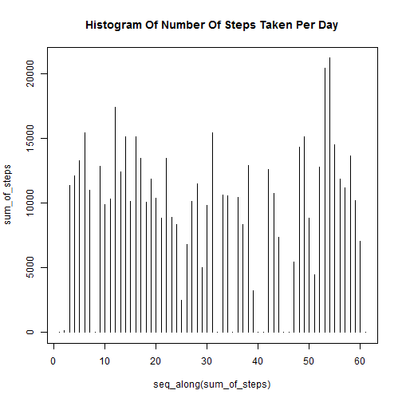
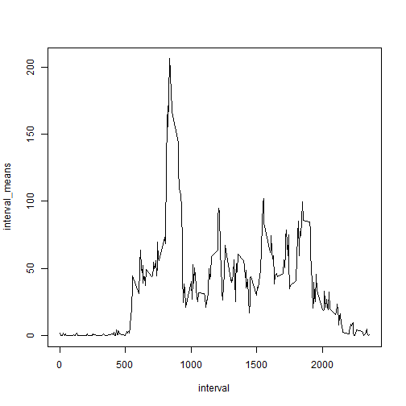
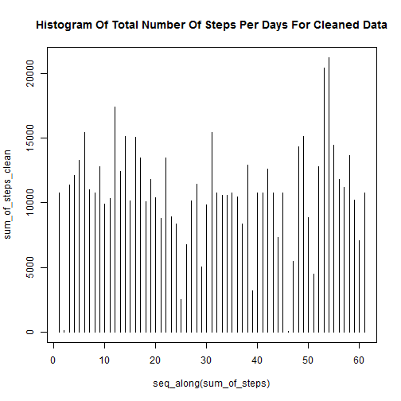
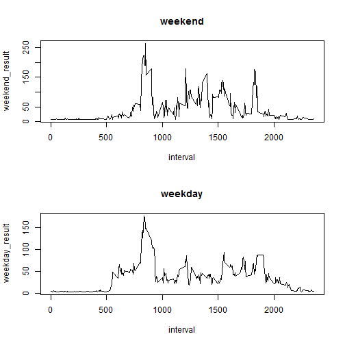

# Reproducible Research: Peer Assessment 1


## Loading and preprocessing the data

```r
raw_data<-read.csv("activity.csv")
splited_data<-split(raw_data$steps,raw_data$date)
sum_of_steps<-seq_along(splited_data)
for (i in 1:length(sum_of_steps)){
  sum_of_steps[[i]]=sum(splited_data[[i]],na.rm=TRUE)
}
```


## What is mean total number of steps taken per day?
* Histogram Of Total Number Of Steps Per Days

```r
plot(seq_along(sum_of_steps),sum_of_steps,type="h",main="Histogram Of Number Of Steps Taken Per Day")
```

 
* Mean And Median Of Total Number Of Steps Taken Per Day

```r
Mean<-lapply(splited_data,mean,na.rm=TRUE)
Median<-lapply(splited_data,median,na.rm=TRUE)
```

```r
head(Mean)
```

```
## $`2012-10-01`
## [1] NaN
## 
## $`2012-10-02`
## [1] 0.4375
## 
## $`2012-10-03`
## [1] 39.42
## 
## $`2012-10-04`
## [1] 42.07
## 
## $`2012-10-05`
## [1] 46.16
## 
## $`2012-10-06`
## [1] 53.54
```

```r
head(Median)
```

```
## $`2012-10-01`
## [1] NA
## 
## $`2012-10-02`
## [1] 0
## 
## $`2012-10-03`
## [1] 0
## 
## $`2012-10-04`
## [1] 0
## 
## $`2012-10-05`
## [1] 0
## 
## $`2012-10-06`
## [1] 0
```


## What is the average daily activity pattern?

```r
splited_by_interval<-split(raw_data$steps,raw_data$interval)
interval_means<-lapply(splited_by_interval,mean,na.rm=TRUE)
interval<-raw_data[1:288,3]
plot(interval,interval_means,type="l")
```

 
* Max Steps

```r
max_interval<-0
max_interval_index<-0
for ( i in 1:length(interval)){
  if (interval_means[[i]]>=max_interval){
    max_interval_index<-interval[i]
    max_interval<-interval_means[[i]]
  }
}
```


## Imputing missing values
* Number Of Missing Values

```r
dim(raw_data)[1]-dim(na.omit(raw_data))[1]
```

```
## [1] 2304
```
* Strategy     
For Imputing missing values replace mean with that missing data       

```r
replaced_mean<-mean(na.omit(raw_data)[,1])
clean_data<-raw_data
for (i in 1:dim(clean_data)[1]){
  if (is.na(clean_data[i,1])){
    clean_data[i,1]=replaced_mean
  }
}
splited_clean_data<-split(clean_data$steps,clean_data$date)
sum_of_steps_clean<-seq_along(splited_clean_data)
for (i in 1:length(sum_of_steps_clean)){
  sum_of_steps_clean[[i]]=sum(splited_clean_data[[i]],na.rm=TRUE)
}
```
* Histogram Of Total Number Of Steps Per Days For Cleaned Data

```r
plot(seq_along(sum_of_steps),sum_of_steps_clean,type="h",main="Histogram Of Total Number Of Steps Per Days For Cleaned Data")
```

 
* Mean And Median Of Total Number Of Steps Taken Per Day For Cleaned Data

```r
Mean_2<-lapply(splited_clean_data,mean,na.rm=TRUE)
Median_2<-lapply(splited_clean_data,median,na.rm=TRUE)
```

```r
head(Mean_2)
```

```
## $`2012-10-01`
## [1] 37.38
## 
## $`2012-10-02`
## [1] 0.4375
## 
## $`2012-10-03`
## [1] 39.42
## 
## $`2012-10-04`
## [1] 42.07
## 
## $`2012-10-05`
## [1] 46.16
## 
## $`2012-10-06`
## [1] 53.54
```

```r
head(Median_2)
```

```
## $`2012-10-01`
## [1] 37.38
## 
## $`2012-10-02`
## [1] 0
## 
## $`2012-10-03`
## [1] 0
## 
## $`2012-10-04`
## [1] 0
## 
## $`2012-10-05`
## [1] 0
## 
## $`2012-10-06`
## [1] 0
```
* Result       
There Is Some Diffrence Between This Part Result And First Part , Because Of Imputing Missing Data And Replace it With Mean Of Total Data.     

## Are there differences in activity patterns between weekdays and weekends?

```r
weekdays<-seq(1,length=dim(raw_data[1]))
```

```
## Warning: first element used of 'length.out' argument
```

```r
for ( i in 1:dim(raw_data)[1]){
  if (weekdays(as.Date(raw_data[i,2]))=="Friday"){
    weekdays[i]="weekday"
    
  }
  else{
    weekdays[i]="weekend"
  }
}
new_data<-cbind(clean_data,weekdays)
```
* Panel Plot

```r
r<-split(new_data,new_data$interval,news_data$weekdays)
weekend_result<-NULL
weekday_result<-NULL
for ( i in 1:length(r)){
  temp_split<-split(r[[i]]$steps,r[[i]]$weekdays)
  weekend_result<-c(weekend_result,mean(temp_split[[1]]))
  weekday_result<-c(weekday_result,mean(temp_split[[2]]))
  }
par( mfrow=c(2,1))
plot(interval,weekend_result,type="l",main="weekend")
plot(interval,weekday_result,type="l",main="weekday")
```

 
