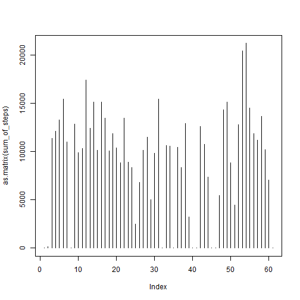
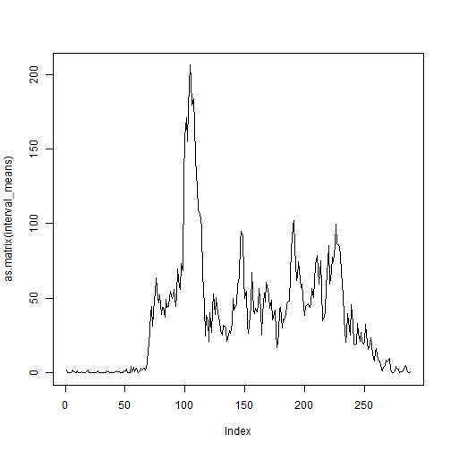

# Reproducible Research: Peer Assessment 1


## Loading and preprocessing the data

```r
raw_data<-read.csv("activity.csv")
splited_data<-split(raw_data$steps,raw_data$date)
sum_of_steps<-seq_along(splited_data)
for (i in 1:length(sum_of_steps)){
  sum_of_steps[[i]]=sum(splited_data[[i]],na.rm=TRUE)
}
```


## What is mean total number of steps taken per day?
* Histogram Of Total Number Of Steps Per Days

```r
plot(as.matrix(sum_of_steps),type="h")
```

 
* Mean And Median Of Total Number Of Steps Taken Per Day

```r
Mean<-lapply(splited_data,mean,na.rm=TRUE)
Median<-lapply(splited_data,median,na.rm=TRUE)
```

```r
head(Mean)
```

```
## $`2012-10-01`
## [1] NaN
## 
## $`2012-10-02`
## [1] 0.4375
## 
## $`2012-10-03`
## [1] 39.42
## 
## $`2012-10-04`
## [1] 42.07
## 
## $`2012-10-05`
## [1] 46.16
## 
## $`2012-10-06`
## [1] 53.54
```

```r
head(Median)
```

```
## $`2012-10-01`
## [1] NA
## 
## $`2012-10-02`
## [1] 0
## 
## $`2012-10-03`
## [1] 0
## 
## $`2012-10-04`
## [1] 0
## 
## $`2012-10-05`
## [1] 0
## 
## $`2012-10-06`
## [1] 0
```


## What is the average daily activity pattern?

```r
splited_by_interval<-split(raw_data$steps,raw_data$interval)
interval_means<-lapply(splited_by_interval,mean,na.rm=TRUE)
plot(as.matrix(interval_means),type="l")
```

 
* Max Steps


## Imputing missing values


## Are there differences in activity patterns between weekdays and weekends?
